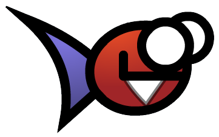

#  PwassonEngine

An HTML5 2D Canvas game engine that aims to runs smoothly by only drawing what really needs to be drawn.  
Initially developed for my personal needs, to develop a remake of a French game, Pwasson. So the name. eheh.

**Note:** This project isn't usable in production, nor in development. That's a work in progress.  
**Demo:** You can try a live demo from source [by clicking here](https://skyzohkey.gitlab.io/PwassonEngine/).

# License
[The MIT License](LICENSE).
